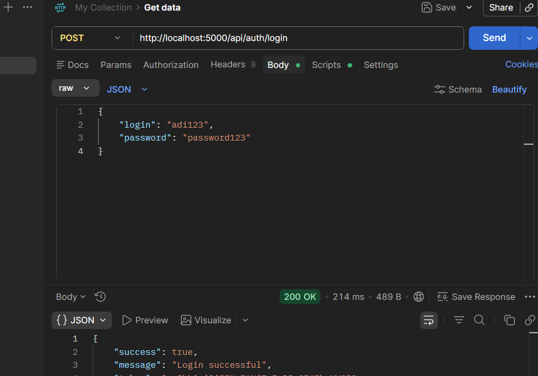
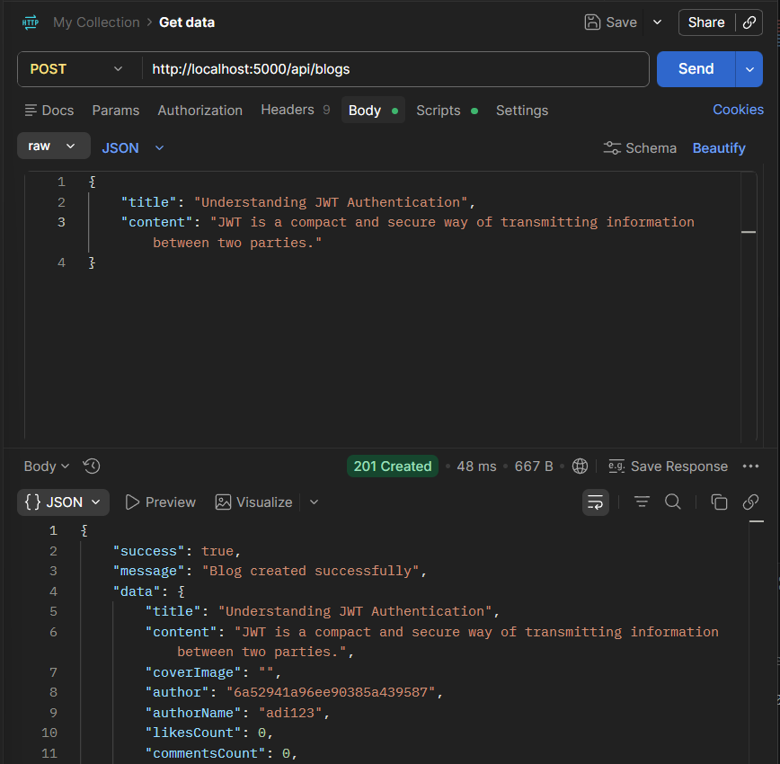
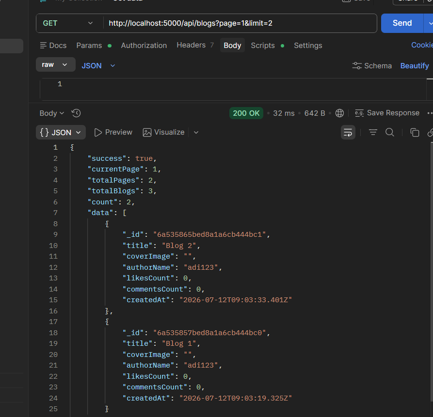
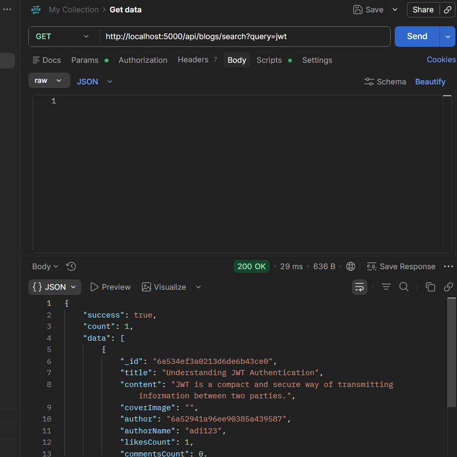
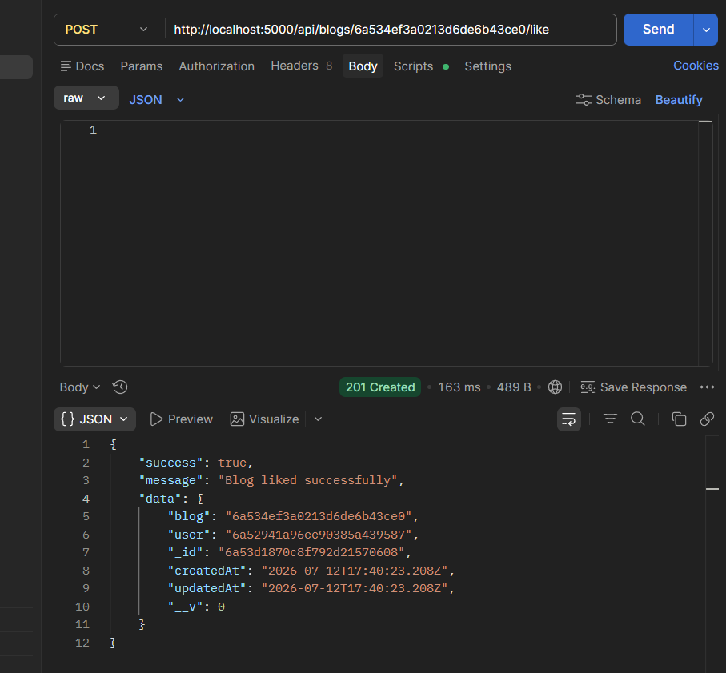
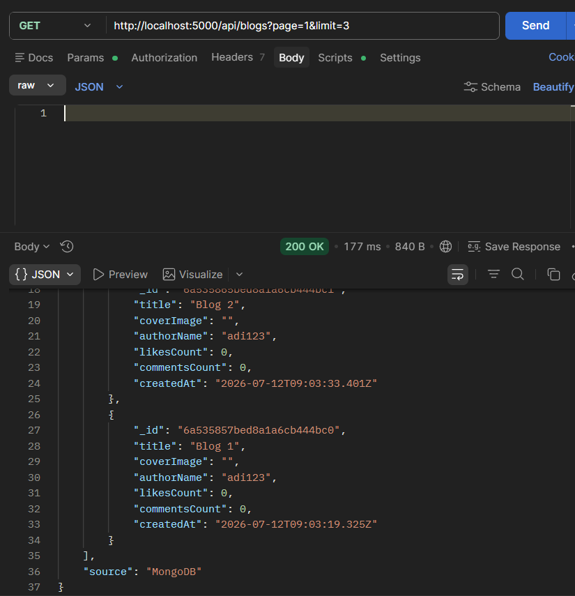
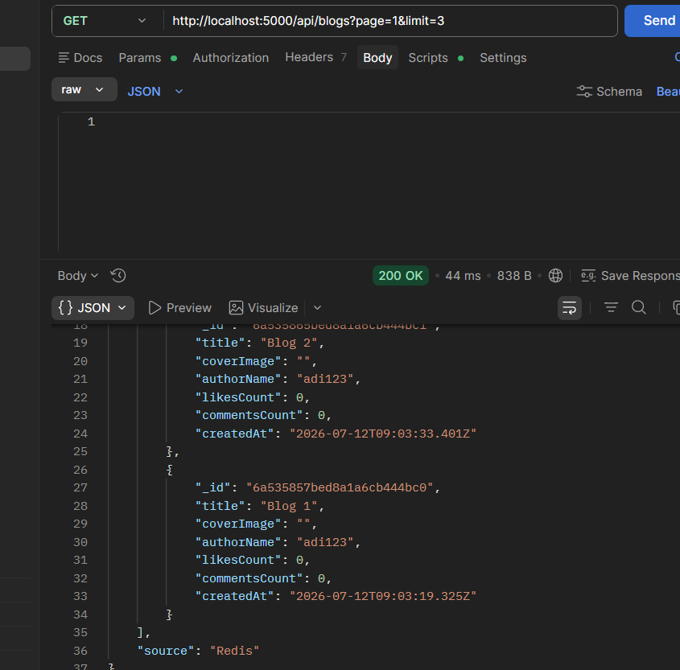

# 🚀 Node.js Blog API

A production-style RESTful Blog API built using **Node.js**, **Express.js**, and **MongoDB**. This project demonstrates backend development concepts such as authentication, authorization, CRUD operations, comments, likes, search, pagination, and modular architecture.

---

## ✨ Features

- 🔐 JWT Authentication
- 📝 Blog CRUD Operations
- 📂 Category Management
- 💬 Comment System
- ❤️ Like / Unlike Blogs
- 🔍 Search Blogs
- 📄 Pagination
- ⚡ Redis Caching (Cache Hit / Cache Miss)
- 🔄 Automatic Cache Invalidation
- ✅ Request Validation using express-validator
- 🏗️ Modular Project Structure

---

## 🛠️ Tech Stack

- Node.js
- Express.js
- MongoDB
- Redis
- Mongoose
- JWT (JSON Web Token)
- bcrypt
- express-validator
- dotenv

---

## 📁 Project Structure

```text
blog-api/
│
├── assets/
├── config/
├── controllers/
├── middlewares/
├── models/
├── routes/
├── validators/
│
├── app.js
├── server.js
├── package.json
├── .env.example
└── README.md
```

---

## 📌 API Modules

### 🔐 Authentication
- Register User
- Login User
- Get Logged-in User Profile

### 📝 Blogs
- Create Blog
- Get All Blogs
- Get Single Blog
- Update Blog
- Delete Blog
- Search Blogs
- Pagination

### 📂 Categories
- Create Category
- Get All Categories
- Update Category
- Delete Category

### 💬 Comments
- Add Comment
- Get Blog Comments
- Update Comment
- Delete Comment

### ❤️ Likes
- Like Blog
- Unlike Blog

## ⚡ Redis Caching

The Blog API uses Redis to improve the performance of the **Get All Blogs** endpoint.

### Caching Strategy

- Cache Hit – Responses are served directly from Redis.
- Cache Miss – Data is fetched from MongoDB, cached in Redis, and returned.
- Automatic Cache Invalidation – Blog-related cache is cleared whenever a blog is created, updated, or deleted.
- Cache Expiration (TTL) – Cached responses automatically expire after 5 minutes to prevent stale data.

## ⚙️ Installation

Clone the repository

```bash
git clone https://github.com/your-username/nodejs-blog-api.git
```

Move into the project directory

```bash
cd nodejs-blog-api
```

Install dependencies

```bash
npm install
```

Create a `.env` file

```env
PORT=5000
MONGODB_URI=your_mongodb_connection_string
JWT_SECRET=your_secret_key
```

Start the server

```bash
npm start
```

or

```bash
node server.js
```

---

## 📸 Screenshots

### 🔐 User Login



---

### 📝 Create Blog



---

### 📄 Get All Blogs (Pagination)



---

### 🔍 Search Blogs



---

### ❤️ Like Blog



---

### ⚡ Redis Cache Miss

First request fetches data from MongoDB and stores it in Redis.



### ⚡ Redis Cache Hit

Subsequent requests are served directly from Redis without querying MongoDB.



## 🚀 Future Improvements

- Cloudinary Image Upload
- MongoDB Transactions
- Role-Based Authorization
- Swagger API Documentation
- Docker Support

---

## 👨‍💻 Author

**Aditya Gosavi**

Fourth Year Information Technology Student

This project was built as a backend learning project to practice REST API development, MongoDB data modeling, authentication, authorization, and scalable backend architecture.